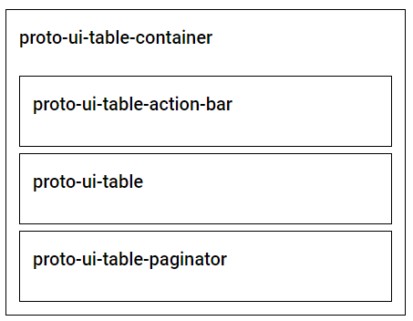
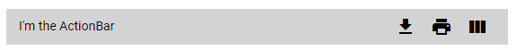

# proto-table

## Building blocks

Every building block is functional on its own but to get the most of them they should be used in combination.

<p align="center">
 
</p>

### proto-ui-table-container

- ✅ Orchestrates subordinate building block
  - binds paginator to table datasource and vice versa
- ✅ Provides access to basic action bar events (export, print, column selection)
- ✅ Building blocks can be placed freely
  - Consuming application has full layout/style control
  - additional elements can be placed inside

#### Usage
Simple usage --> not stylable
```html
<proto-ui-table-container></proto-ui-table-container>
```
Linked to DOM element --> stylable
```html
<div proto-ui-table-container></div>
```

### proto-ui-table-action-bar
- ✅ Highly customizable
- ✅ Optional default action items
  - `proto-ui-table-export-action`, `proto-ui-table-print-action`, `proto-ui-table-column-selection-action`

#### Usage
```html
<div proto-ui-table-action-bar (export)="export()" (print)="print()" (columnSelection)="columnSelection()">

  <span>I'm the ActionBar</span>

  <span class="spacer"></span>

  <button mat-icon-button proto-ui-table-export-action>
    <mat-icon>file_download</mat-icon>
  </button>

  <button mat-icon-button proto-ui-table-print-action>
    <mat-icon>print</mat-icon>
  </button>

  <button mat-icon-button proto-ui-table-column-selection-action>
    <mat-icon>view_column</mat-icon>
  </button>

</div>
```
Above template will produce the following (gray background via stylesheet):
<p align="center">
 
</p>